---
author-meta:
- David R. Slochower
- Niel M. Henriksen
- John D. Chodera
- Michael K. Gilson
date-meta: '2019-04-17'
keywords:
- markdown
- publishing
- manubot
lang: en-US
title: Binding thermodynamics of host-guest systems with SMIRNOFF99Frosst from the
  Open Force Field Group
...

<small><em>
This manuscript
([permalink](https://slochower.github.io/smirnoff-host-guest-manuscript/v/464c3dbb03c77eb3fa7a087b740150a276e6afe3/))
was automatically generated
from [slochower/smirnoff-host-guest-manuscript@464c3db](https://github.com/slochower/smirnoff-host-guest-manuscript/tree/464c3dbb03c77eb3fa7a087b740150a276e6afe3)
on April 17, 2019.
</em></small>

## Authors

+ **David R. Slochower** 
    {.inline_icon}
    [0000-0003-3928-5050](https://orcid.org/0000-0003-3928-5050)
    · {.inline_icon}
    [slochower](https://github.com/slochower)
    · {.inline_icon}
    [drslochower](https://twitter.com/drslochower) 
  <small>
     Skaggs School of Pharmacy and Pharmaceutical Sciences, University of California, San Diego, La Jolla, CA 92093, USA
  </small>

+ **Niel M. Henriksen** 
    {.inline_icon}
    [0000-0002-7916-0757](https://orcid.org/0000-0002-7916-0757)
    · {.inline_icon}
    [nhenriksen](https://github.com/nhenriksen) 
  <small>
     Atomwise, Inc., San Francisco, CA 94105, USA
  </small>

+ **John D. Chodera** 
    {.inline_icon}
    [0000-0003-0542-119X](https://orcid.org/0000-0003-0542-119X)
    · {.inline_icon}
    [jchodera](https://github.com/jchodera)
    · {.inline_icon}
    [jchodera](https://twitter.com/jchodera) 
  <small>
     Computational and Systems Biology Program, Sloan Kettering Institute, Memorial Sloan Kettering Cancer Center, New York, NY 10065
  </small>

+ **Michael K. Gilson** 
    {.inline_icon}
    [0000-0002-3375-1738](https://orcid.org/0000-0002-3375-1738)
    · {.inline_icon}
    [michaelkgilson](https://twitter.com/michaelkgilson) 
  <small>
     Skaggs School of Pharmacy and Pharmaceutical Sciences, University of California, San Diego, La Jolla, CA 92093, USA
  </small>

## Abstract {.page_break_before}

Designing ligands that bind their target with high affinity and specificity is a key step in small-molecule drug discovery. Yet accurate predictions of protein-ligand binding free energies are difficult and errors in the calculations can be traced to challenges adequately sampling conformational space, ambiguous protonation states, and other causes. Noncovalent complexes between a cavity-containing host molecule and drug-like guest molecules have emerged as powerful tools for modeling protein-ligand binding. Due to their small size and extensive experimental characterization, calculations of host-guest binding free energies, enthalpies, and entropies offer an opportunity to directly probe, and ultimately optimize, force fields.

The Open Force Field Initiative aims to create a modern, open software infrastructure for automatically generating and validating force fields using high-quality data sets. The first force field to arise out of this effort, named SMIRNOFF99Frosst, has one tenth the number of parameters of a typical general small molecule force field, such as GAFF, yet predicts binding thermodynamics that are on average, at least as accurate. Here, we report the results of free energy calculations on 43 $\alpha$ and $\beta$-cyclodextrin host-guest pairs for which experimental data are available. Our calculations were performed using the attach-pull-release method as implemented in the open source package, `pAPRika`. On binding free energies, the root mean square error of the predictions relative to experiment is 0.82 kcal/mol for SMIRNOFF99Frosst and 1.58 kcal/mol for GAFF version 2.1. These results suggest significant room for improvement in force fields, and will help create a transparent and robust method of evaluating future candidate parameter sets from the Open Force Field Group. Improving the performance of force fields for predicting binding affinities will help reduce the timescale and cost required to generate drug candidates.

## Introduction

## Methods

### Chose of host-guest system
In this study, we report the binding thermodynamics of 43 host-guest complexes ([@fig:host-guest-pairs]) computed using three different force fields. 
The complexes consist of either α- or β-cyclodextrin as host molecule and a series of ammonium, carboxylate, or cyclic alcohol small molecule guests.
Cyclodextrins are cyclic polymers consisting of six (αCD) or seven (βCD) glucose monomers in the shape of a truncated cone.
The equilibrium constants and standard molar enthalpies of binding for these 43 complexes have been measured using isothermal titration calorimetry [@1236RpaUv] and computationally in [@HVgz5rZq].
As in [@HVgz5rZq], only a single structural isomer was considered for the 1-methylammonium guests.

{#fig:host-guest-pairs}

### Application of force field parameters

We sought to compare force fields directly, and as such, attempted to minimize additional differences between the simulation sets.
In all simulations, we applied AM1-BCC [@LxrgIkt0; @BkLoOd0N] partial atomic charges to both the host and guest molecules using the `antechamber`program.
The host charges were calculated using a single glucose molecule with methoxy caps on the O1 and O4 alcohols ([ @fig:atom-names]); each glucose monomer in the cyclodextrin polymer has identical charges.
We used TIP3P water [@chrX4HGh] and Joung-Cheatham monovalent ion parameters for $\ce{Na+}$ and $\ce{Cl-}$ [@uZnQBwCt] in each simulation set.

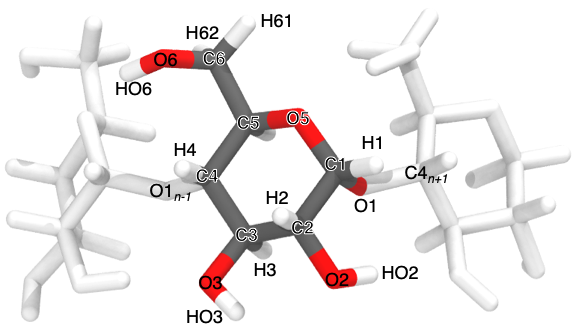{width=3.5in}
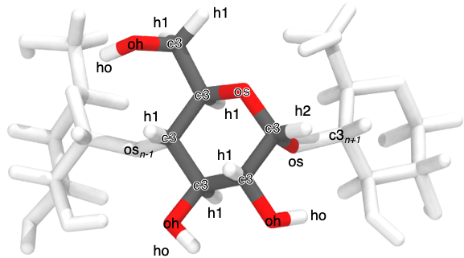{width=3.5in}

Atom names (left) and GAFF atom types (right) for a glucose monomer in αCD shown with two flanking monomers. The remaining three glucose monomers are hidden for clarity.

GAFF v1.7 bond, angle, torsion, and Lennard-Jones parameters were applied using the `tleap` program distributed with AmberTools16. These simulations were performed as part of Henriksen, et al.  [@HVgz5rZq] and are described in additional detail therein.

GAFF v2.1 parameters were applied in an identical manner to the GAFF v1.7 parameters, using the `tleap` program distributed with AmberTools18 and substituting `leaprc.gaff` for `leaprc.gaff2`in the `tleap`input file.
In GAFF v2.1, the bond and angle parameters have been updated to reproduce small molecule geometries obtained from high-level quantum mechanical calculations.
The force constants for the bond and angle parameters were tuned to reproduce the vibrational spectra of over 600 molecules.
The torsion parameters were optimized to reproduce the rotational potential energy surface of 400 model compounds.
Finally, the Lennard-Jones coefficients were redeveloped to reproduce interaction energies and pure liquid properties.
[We might want to cite `gaff2.dat` somehow, because this is where I obtained the above information; we could also cite personal communications with Junmei Wang based on our conversations at the Amber developers' meeting.]{.banner .lightgrey}

To apply SMIRNOFF99Frosst parameters, we followed a [multistep process](https://github.com/slochower/smirnoff-host-guest/blob/master/02-convert-APR-files.ipynb), beginning with the prepared GAFF v1.7 files.
The host and guest molecules were parameterized with the Open Force Field Toolkit version 0.0.3, SMIRNOFF version 1.0, and SMIRNOFF99Frosst version 1.0.5.
Once parameterized with SMIRNOFF99Frosst, ParmEd [@T7iFp9ei] was used to combine the host and guest with the solvent and ions, which retained their parameters as TIP3P water and Joung-Cheatham ion parameters, respectively.

[I decided to skip a detailed listing of what I did, and instead link to the Jupyter notebook I used, because these instructions may change with future toolkit versions, and in fact, it is already out of date in some ways. If this is a good way to cite this, I can upload that GitHub repository to Zenodo, get a DOI, and cite the DOI. It may also be feasible to include this as SI, but that can get messy for anything other than trivial code listings.]{.banner .lightgrey}

### Thermodynamic calculation
We used the attach-pull-release (APR) method as implemented in the open source package pAPRika version 0.0.3, to calculate absolute binding free energies.
A complete description of the APR method has been characterized in the literature [@1935a9V0d; @W9FLyOZr; @GA1AFcUw; @1HWPx2yMR].
The attachment and release phases consisted of 15 independent windows; the pulling phase consisted of 45 independent windows.
During the attachment phase, the force constants on the host and guest are scaled by a $\lambda$ parameter that goes from $\lambda = 0$, when all restraints are turned off, to $\lambda = 1$, when all restraints reach their maximum force constant. The $\lambda$ windows are more densely spaced where the force constant is smaller to improve sampling along highly curved regions of the potential of mean force.
Conformational restraints were applied between neighboring glucose units of the cyclodextrin to limit the incursion of monomers into the host cavity. These restraints were applied along the pseudodihedrals $\ce{{O5}_n-{C1}_n-{O1}_n-{C4}_{n+1}}$ and $\ce{{C1}_n-{O1}_n-{C4}_{n+1}-{C5}_{n+1}}$ to improve convergence and sampling of the bound state (see [@fig:atom-names]for atom naming conventions). To further improve convergence of the bound state, we applied a hard wall restraint that confined the guest molecule to within a sphere of 12.3 and 13.5 Å of αCD and βCD, respectively. 

During the pulling phase, the $\lambda$ parameter represented a distance restraint and is increased uniformly in 45 increments of 0.4 Å, yielding windows that separate the host and guest by 18 Å. An explicit release calculation is performed to turn off the conformational restraints on the host in the absence of guest molecules. This is performed once for each cyclodextrin. An analytic release calculation is performed to compute the work of moving the guest from the restricted volume enforced by the APR restraints to standard state at 1 M concentration. 

[Needs editing]{.banner .lightgrey}

Due to the lack of symmetry of cyclodextrin and the small molecule guests, there are generally two distinct binding poses. We separately compute the binding free energy and enthalpy for each orientation [@1935a9V0d] and combine the results to produce a single value for each host-guest combination.

% For simple guest molecules, with one polar functional group, there are generally two possible binding modes in the CD cavity: one with the polar group oriented out of the CD opening with primary alcohols, and one with the polar group oriented out of the wider opening with secondary alcohols (Figure 2). However, experimental data report binding free energy and enthalpy values based on a Boltzmann-weighted ensemble of these two orientations. In order to compare with experiment, we separately compute and appropriately combine the binding free energy and enthalpy for each orientation, as previously described.40 

Thermodynamic integration was used to compute the binding free energy. The binding enthalpy was computed as the difference in mean potential energy of the bound state (in the absence of any restraints) and the unbound state (where the guest is held far away from the host, but the conformational restraints on the host are disabled).

% The binding enthalpy was computed by subtracting the average potential energy of the last window of the release phase, in which the guest has been pulled far away from the host, from the mean energy of the first window of the attachment phase, in which restraint force constants are off. The uncertainties for average properties calculated in each window (e.g., restraint coordinate values and potential energies) were estimated with the blocking method42 and propagated into the final reported values using bootstrapping for the thermodynamic integration calculations, or addition in quadrature for the binding enthalpy calculations.

Uncertainties were computed using blocking analysis [@htck51Lp].

### Simulations
Simulations were performed with the `pmemd.cuda` module of AMBER 16 (calculations of the GAFF v1.7 force field) and AMBER 18 (calculations of the GAFF v2.1 and SMIRNOFF99Frosst force fields) molecular dynamics software [@197xzzCJg]. Each window for each system was independently solvated and simulated.

Solvation consisted of 2000 TIP3P waters for the αCD systems and 2210 waters for the βCD systems in an orthorhombic box. Each simulation contained enough $\ce{Na+}$ or $\ce{Cl-}$ ions to neutralize the host-guest complex  and an additional 50 mM $\ce{NaCl}$ to match the experimental conditions in [@1236RpaUv]. The host and guest were oriented via non-interacting dummy atoms along the simulation box $z$ axis to minimize the amount of solvent required. Hydrogen mass repartitioning was used to adjust the mass of hydrogen atoms to 3.024 Da by transferring mass from bonded heavy atoms, enabling a simulation timestep of 4 fs. Equilibration consisted of 50,000 steps of energy minimization, 100 ps of heating from 0 to 300 K, followed by 2000 ps of additional NPT simulations. A Langevin thermostat, the Monte Carlo barostat, a nonbonded cutoff of 9 Å and default PME parameters, were used for the NPT simulations.

Production NPT simulations were run for a minimum of 5 ns and maximum of 50 ns per window, except for the endpoint windows used to calculate the enthalpy, which were simulated for 1 μs. In the GAFF v1.7 and GAFF v2.1 simulations, the exact length of each window's simulation was determined by the restraint coordinate uncertainty, estimated via blocking analysis [@htck51Lp]. That is, for restraint energy $U$ in window $i$, each window was simulated until the variable

\begin{equation}
    w(\lambda_i) = 
    \begin{cases}
    \left\langle \frac{\partial U}{\partial \lambda_i} \right\rangle_\text{SEM} \cdot \frac{\lambda_{i+1}}{2} & i = 0 \\
    \left\langle \frac{\partial U}{\partial \lambda_i} \right\rangle_\text{SEM} \cdot \frac{\lambda_{i+1} - \lambda_{i-1}}{2} & i \in [1, N-1] \\
    \left\langle \frac{\partial U}{\partial \lambda_i} \right\rangle_\text{SEM} \cdot \frac{1 - \lambda_{i-1}}{2} & i = N \\
    \end{cases}
\end{equation}

was below a threshold = 0.02 kcal/mol during the attach phase and 0.1 kcal/mol during the pull phase.

[This is ambiguous because $i=0$ and $i=N$ during attach and release are run for longer than this.]{.banner .lightgrey}

SMIRNOFF99Frosst simulations calculations were run for 10 ns per window.

### Statistics
The overall RMSE and R$^2$ values for each comparison are reported as the mean with the 95% confidence interval in brackets after 100,000 bootstrapping cycles. The R$^2$ values for each functional group subset is reported in the bottom right corner.

For each force field, we computed RMSE, MSE, R$^2$, Kendall $\tau$.  [What else?]{.banner .lightgrey}

## Results and discussion

This results section is organized as follows. We first present a comparison of SMIRNOFF99Frosst and two iterations of the General AMBER Force Field (GAFF [@YmRgHfeU]) on predicting binding free energies (ΔG) and binding enthalpies (ΔH) of small molecule guests to α-cyclodextrin (αCD) and β-cyclodextrin (βCD). 
We then detail how the behaviors of guest molecules changes between force fields and finally we summarize the parameter differences between SMIRNOFF99Frosst and GAFF along with the effects of the parameter differences. 

### Binding free energies and enthalpies

SMIRNOFF99Frosst does about as well as, or even better than GAFF v1.7, depsite have far fewer numerical parameters on predicted ΔG and ΔH compared to the values measured with isothermal titration calorimetry. 
SMIRNOFF99Frosst has an overall agreement of under 1 kcal/mol on binding free energies and under 2 kcal/mol on binding enthalpies across the 43 host-guest systems ([@fig:dG-dH]).
Overall, the correlation between SMIRNOFF99Frosst and experiment is mediocre, ranging from an R$^2$ value of 0.34 to 0.54 for ΔG.
The results are more varied for ΔH with R$^2$ ranging from 0.09 to 0.54.
In particular, SMIRNOFF99Frosst underestimates the binding free energy and binding enthalpy of cyclic alcohols and mostly underestimates the binding entropy ([@fig:TdS]).
Guests containing ammonium or carboxylate functional groups appear to be equally over- and under-estimated for binding free energy.

Notably, SMIRNOFF99Frosst does better on αCD than βCD ([@fig:dG-dH-by-cyclodextrin]).

{#fig:somethingA width=3.5in}
{#fig:somethingB width=3.5in}

{width=3.5in}
{width=3.5in}

{width=3.5in}
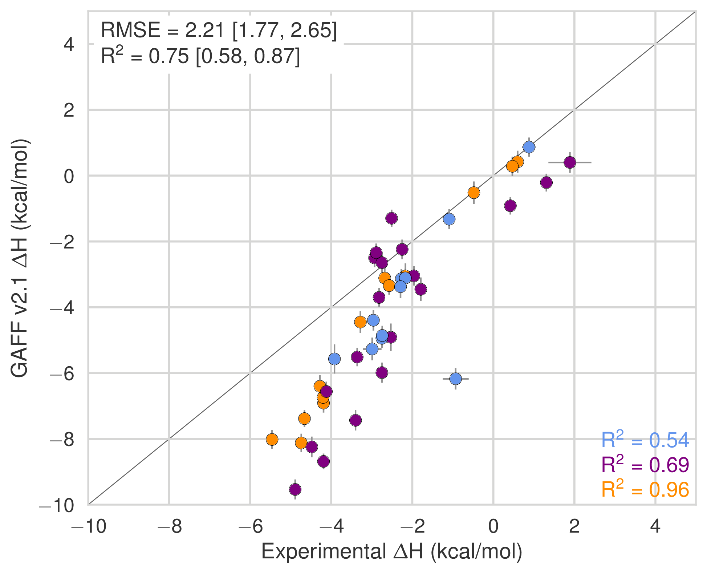{width=3.5in}

Comparison of calculated absolute binding free energies (ΔG) and binding enthalpies (ΔH) with experiment with SMIRNOFF99Frosst parameters (top), GAFF v1.7 parameters (middle), or GAFF v2.1 parameters (bottom) applied to both host and guest. The orange, blue, and purple coloring distinguish the functional group of the guest as an ammonium, alcohol, or carboxylate, respectively.

Likewise, GAFF v1.7 has very similar properties with an RMSE for ΔG of 0.88 kcal/mol and RMSE for ΔH of 2.54 kcal/mol.
Both SMIRNOFF99Frosst and GAFF v1.7 systematically underestimate the binding free energy for cyclic alcohols except for beta-cyclodextrin with cyclopentanol (b-cpe).

Overall, GAFF v2.1 has a larger RMSE than either SMIRNOFF99Frosst or GAFF v1.7 on binding free energies, but strikingly strong correlations with the experimental values across all three functional group classes.
Compared to SMIRNOFF99Frosst and GAFF v1.7, GAFF v2.1 uniformly overestimates both the binding free energy and binding enthalpy.

SMIRNOFF99Frosst does a great job predicting the binding free energy of αCD with alcohols, with four of the five points nearly falling on the line of identity.

[Show highlights here]{.banner .lightgrey}

Likewise, SMIRNOFF99Frosst does a great job with amines (?) with three of the four points falling nearly on the line of identity.

With βCD, on teh other hand, things are a little different: two of the three carboxylates are overestimated, ammoniums are great, but the alcohols are all over the place (two overestimated, two understimated.)

This difference is likely because... (?) of flexibility? (Is alpha more flexible than beta?)

### Guest preferences for primary and secondary binding

There are two orientations for binding: one where the primary functional group is interacting with the more narrow opening primary alcohols and one with the polar group oriented out of the wider, secondary opening.

The experimental data is a Boltzmann weighted ensemble of these two orientations.

{width=3.5in}
{width=3.5in}

Binding free energies (ΔG) with the primary orientation results colored in blue and secondary orientation results colored in green.

{width=3.5in}
{width=3.5in}

Binding free energies (ΔG) replotted from [@fig:by-orientation-comparison] with points whose difference in binding free energy along either axis is greater than 2 kcal/mol shown in color. Arrows point from primary to secondary. `This is backwards of the next plot.`

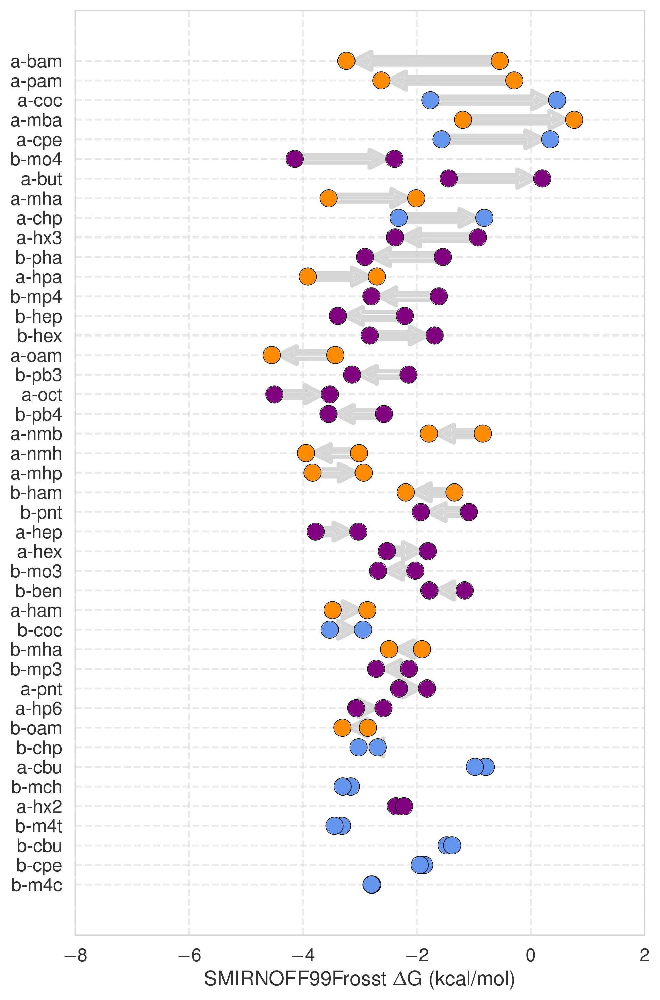{width=3.5in}
{width=3.5in}
{width=3.5in}

The differences in binding free energy (ΔG) between guests leaving through either the primary or secondary face of αCD or βCD. Arrows point from the binding affinity for the secondary to the binding affinity for     the primary cavity. The systems with the largest ΔG difference are placed at the top.

### Guest preferences for αCD and βCD

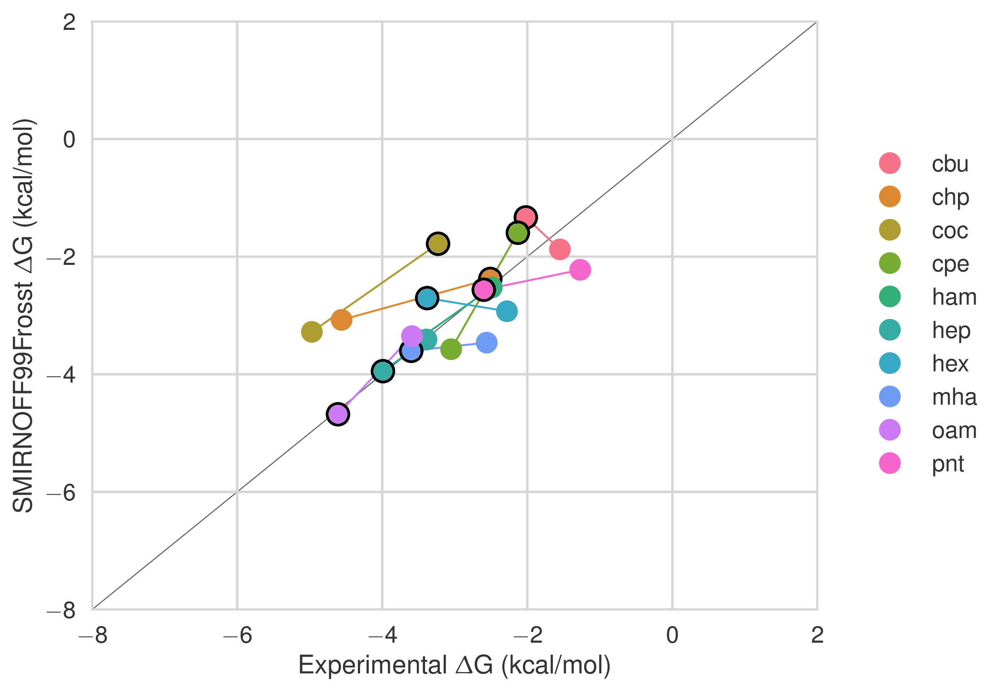{width=3.5in}
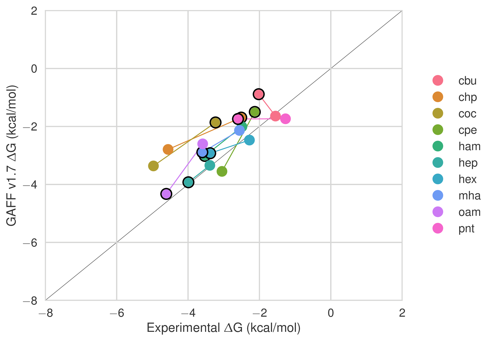{width=3.5in}
{width=3.5in}

The differences in binding free energy (ΔG) between the same guest binding to either αCD or βCD. The binding affinity for αCD is circled in black.

### Functional group interactions

{width=3.5in}
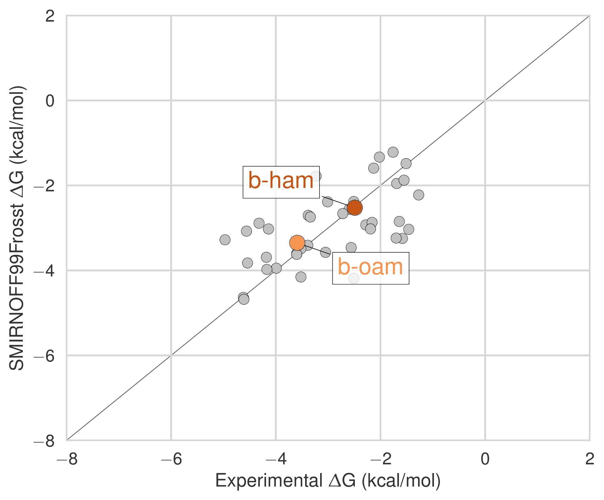{width=3.5in}

Binding free energy (ΔG) comparisons showing ammonium guests in color and highlighted. Darker colors indicate... 

{width=3.5in}
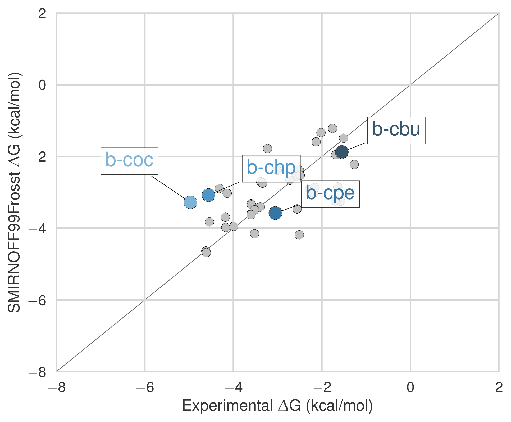{width=3.5in}

Binding free energy (ΔG) comparisons showing alcohols guests in color and highlighted. Darker colors indicate... 

{width=3.5in}
{width=3.5in}

Binding free energy (ΔG) comparisons showing alcohols guests in color and highlighted. Darker colors indicate... 

### Differences in force field parameters between SMIRNOFF99Frosst and GAFF

Next, we summarize the parameter differences between SMIRNOFF99Frosst, a decendent of parm@Frosst and GAFF v1.7 (released circa March 2015 according to `gaff.dat` distributed with AMBER16) and GAFF v2.1 (under active development).

The σ and ε parameters are identical between SMIRNOFF99Frosst and GAFF v1.7
Compared to GAFF v2.1, SMIRNOFF99Frosst has deeper well depths for oxygens and decreased σ values for the hydroxyl hydrogens.

{width=3.5in}
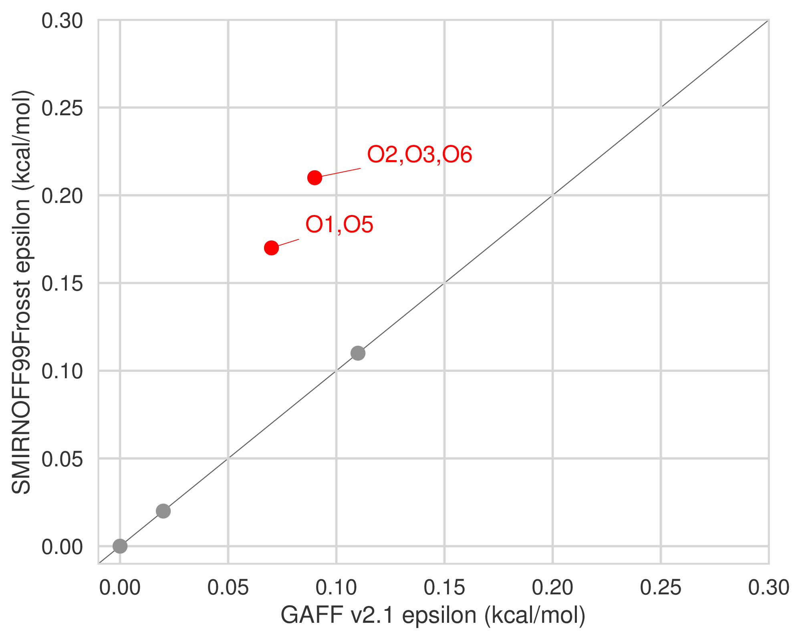{width=3.5in}

A comparison of Lennard-Jones nonbonded parameters for SMIRNOFF99Frosst and GAFF v2.1. Values that differ by more than 10% are labeled in red. Atom names refer to [@fig:atom-names]. 

Compared to GAFF v1.7, SMIRNOFF99Frosst tends to have slightly larger bond force constants, except for the $\ce{O-H}$ hydroxyl bond force constant, which is much stronger.
In GAFF v2.1, the $\ce{O-H}$ hydroxyl bond force constant is consistent with SMIRNOFF99Frosst, but the carbon-oxygen bond constants are weaker.
Equilibrium bond lengths are very similar ([@fig:bond-req]).

{width=3.5in}
{width=3.5in}

A comparison of bonded parameters for SMIRNOFF99Frosst, GAFF v1.7, and GAFF v2.1. Values that differ by more than 10% are labeled in red. Atom names refer to [@fig:atom-names]. 

Relative to GAFF v1.7 and GAFF v2.1, SMIRNOFF99Frosst has fewer unique angle parameters applied to αCD; several distinct parameters appear to be compressed into a single force constant, around 50 kcal/mol/rad^2^.
These parameters correspond to $\ce{C-C-C}$, $\ce{C-O-C}$, and $\ce{O-C-O}$ angles.
The $\ce{C-C-C}$ angles are primarily around the ring of the glucose monomer.
The $\ce{C-O-C}$ angles are both around the ring and between monomers (e.g., $\ce{C1-O1-C4}$ and $\ce{C1-O5-C5}$).
Weaker force constants for these parameters may  lead to increased flexibility.

{width=3.5in}
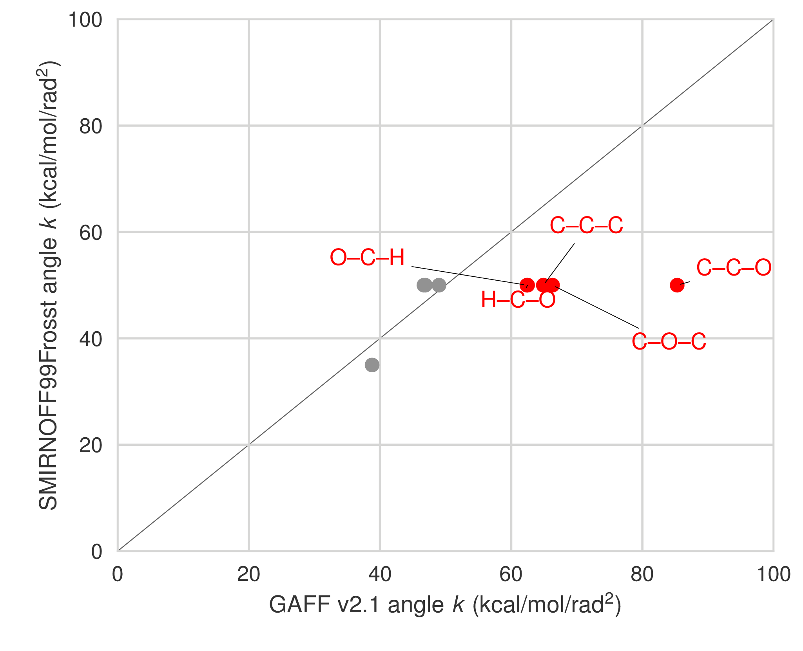{width=3.5in}

{width=3.5in}
{width=3.5in}

A comparison of angle parameters for SMIRNOFF99Frosst, GAFF v1.7, and GAFF v2.1. Values that differ by more than 10% are labeled in red. Precise atom names have been omitted to compress multiple angles with the same parameter values into a single label.

[Include the table of dihedral differences here.]{.banner .lightgrey}

The dihedral parameters in GAFF v2.1 differ significantly from those in SMIRNOFF99Frosst.

![The dihedral energy term applied to H1-C1-C2-O2 in SMIRNOFF99Frosst and GAFF v1.7. Atom names refer to [@fig:atom-names].](images/SMIRNOFF99Frosst-vs-GAFF-v1.7-H1-C2-C2-O2.png){#fig:dihedral width=3.5in}

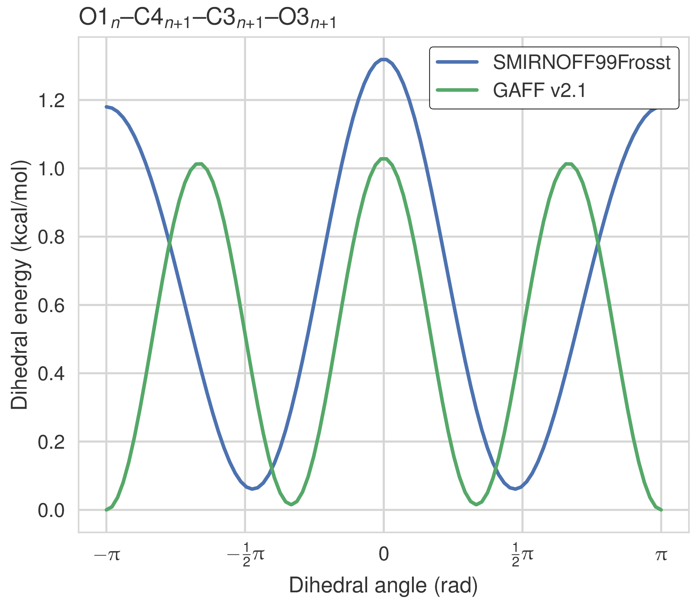{width=3.5in}
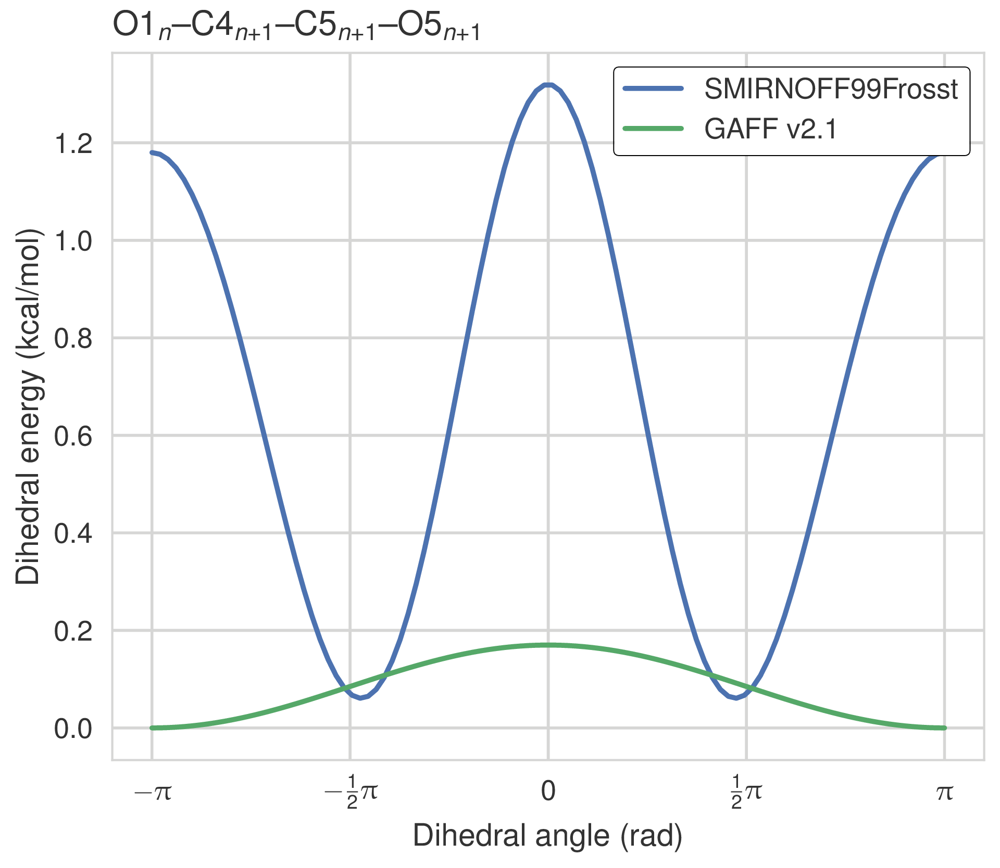{width=3.5in}
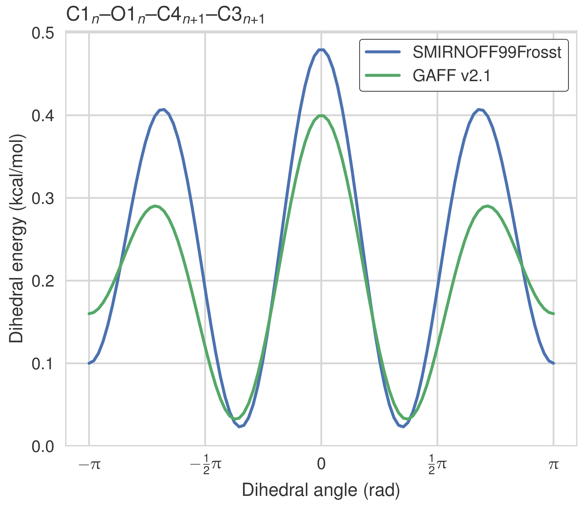{width=3.5in}

The dihedral energy term applied to three inter-residue dihedrals in SMIRNOFF99Frosst and GAFF v2.1. The third dihedral, affecting atoms O1n--C4n+1--C5n+1--O5n+1 is quite significantly different, with multiple minima and and barrier heights. This dihedral partially controls the rotation of glucose monomers towards or away from the interior of the cyclodextrin cavity. Surprisingly, glucose monomers in GAFF v2.1 penetrate the open cavity much less frequently than in SMIRNOFF99Frosst, despite the lower and broader dihedral energy in GAFF v2.1. Atom names refer to [@fig:atom-names]. 

### Structural consequences of the force field parameter differences

In both SMIRNOFF99Frosst and GAFF v1.7, the average RMSD of βCD is between 2 and 2.5 Å over 43 μs of simulation. GAFF v2.1 is significanly more rigid, with an average RMSD less than 1.0 Å from the initial structure ([@fig:flexibility]).

{#fig:flexibility width=100%}

<link rel="stylesheet" href="https://use.fontawesome.com/releases/v5.7.2/css/all.css">
 [<i class="fas fa-star"></i> Update font size in RMSD plots.]{.banner .lightgrey}

## Supporting Information {.page_break_before}

{width=3.5in}
{width=3.5in}
{width=3.5in}

Comparison of calculated absolute binding entropies (−TΔS) with experiment with SMIRNOFF99Frosst parameters (top), GAFF v1.7 parameters (middle), or GAFF v2.1 parameters (bottom) applied to both host and guest. The orange, blue, and purple coloring distinguish the functional group of the guest as an ammonium, alcohol, or carboxylate, respectively.

{width=3.5in}
{width=3.5in}
{width=3.5in}

Comparison of calculated absolute binding free energies (ΔG) between force field combinations. The orange, blue, and purple coloring distinguish the functional group of the guest as an ammonium, alcohol, or carboxylate, respectively.

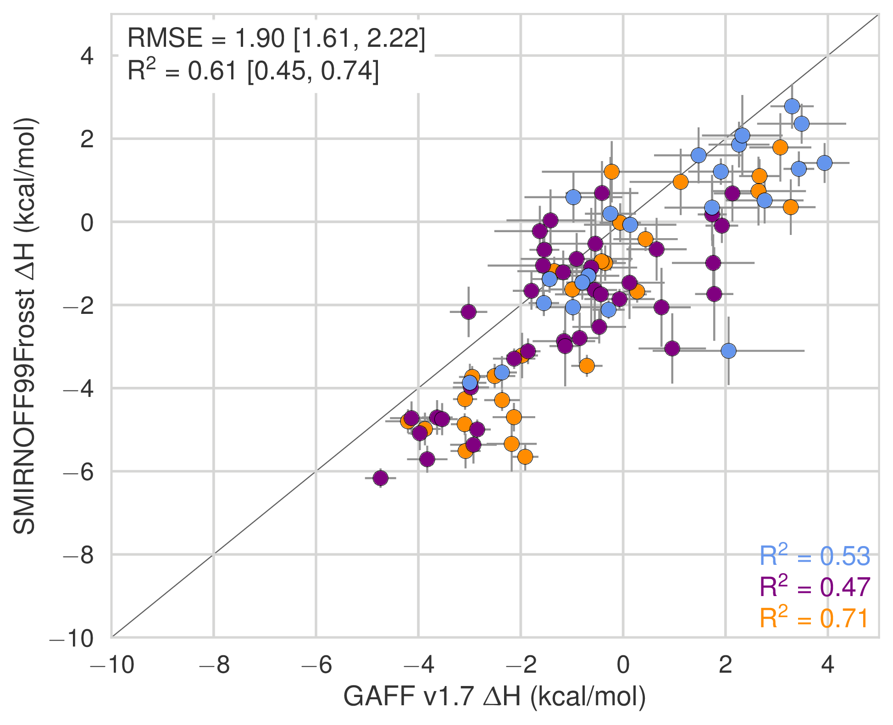{width=3.5in}
{width=3.5in}
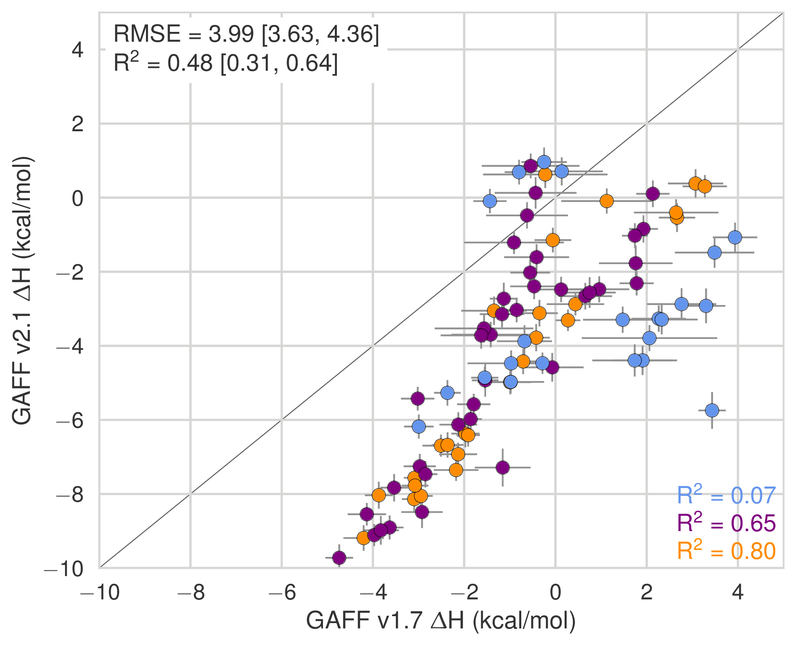{width=3.5in}

Comparison of calculated absolute binding free enthalpies (ΔH) between force field combinations. The orange, blue, and purple coloring distinguish the functional group of the guest as an ammonium, alcohol, or carboxylate, respectively.

{width=3.5in}
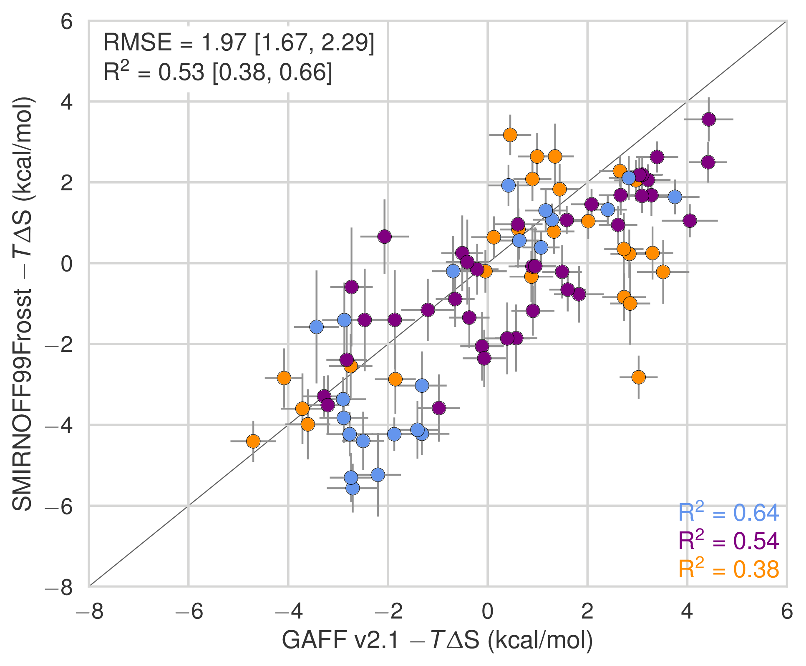{width=3.5in}
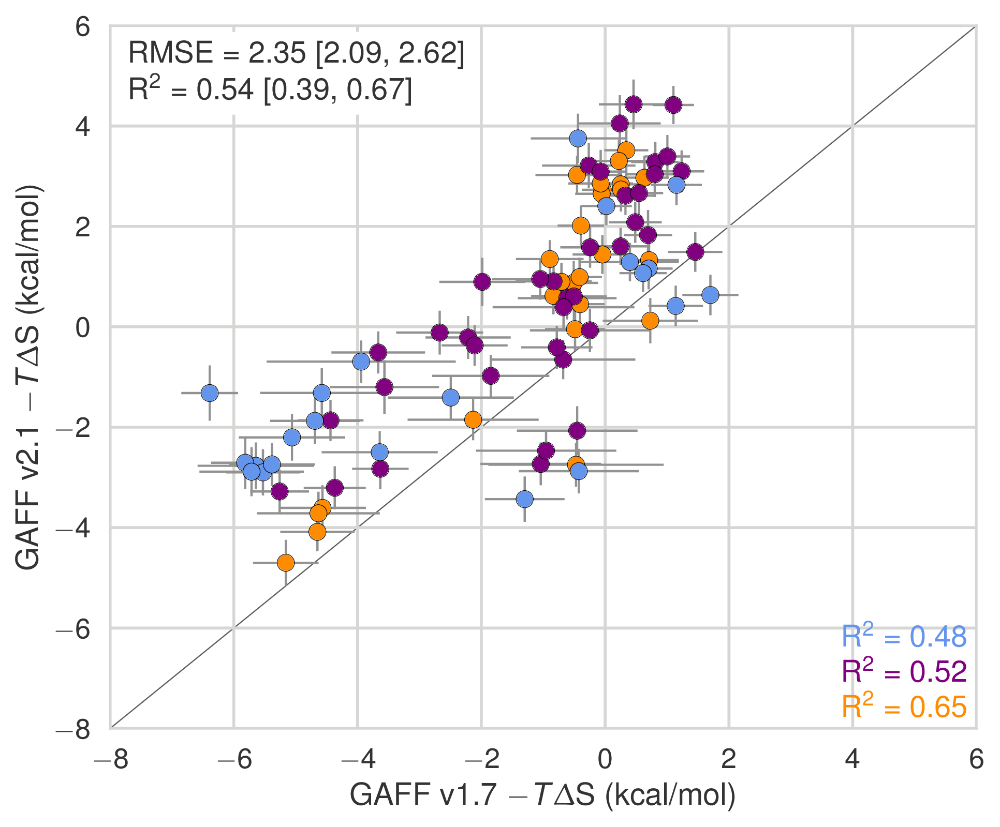{width=3.5in}

Comparison of calculated absolute binding free entropies (-TΔS) between force field combinations. The orange, blue, and purple coloring distinguish the functional group of the guest as an ammonium, alcohol, or carboxylate, respectively.

{width=3.5in}
{width=3.5in}

{width=3.5in}
{width=3.5in}

{width=3.5in}
{width=3.5in}

Binding free energies (ΔG) replotted from [@fig:dG-dH], with αCD points colored in blue and βCD points in grey (left) or αCD points in grey with βCD points colored in green (right).

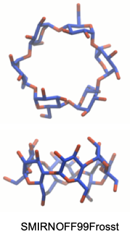{#fig:cyclodextrin-snapshot width=3.5in}

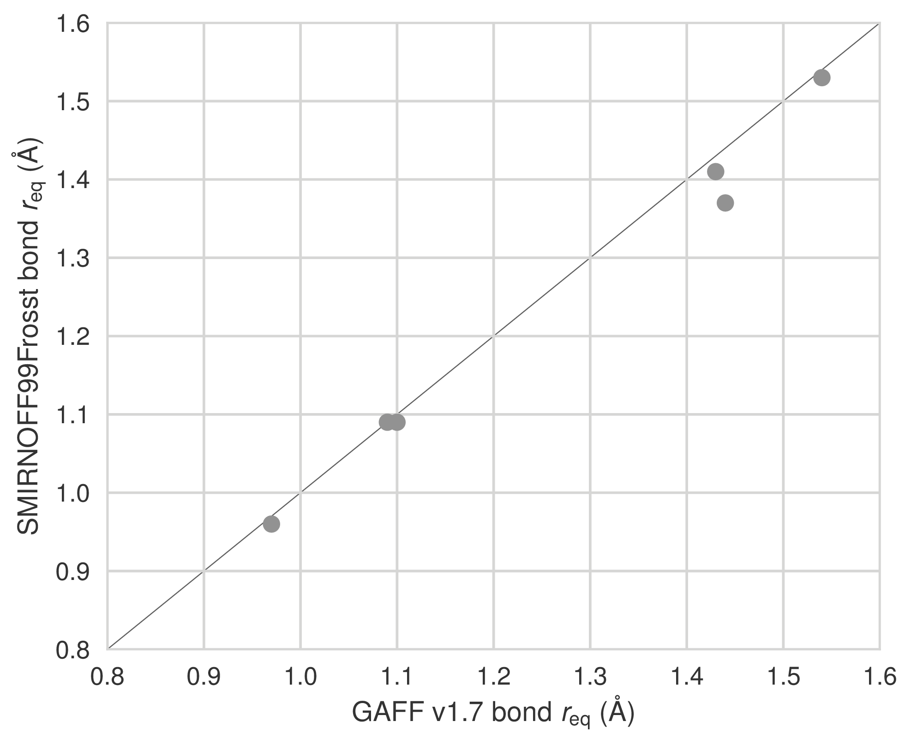{width=3.5in}
{width=3.5in}

A comparison of bond equilibrium lengths for SMIRNOFF99Frosst, GAFF v1.7, and GAFF v2.1. Atom names refer to [@fig:atom-names]. 

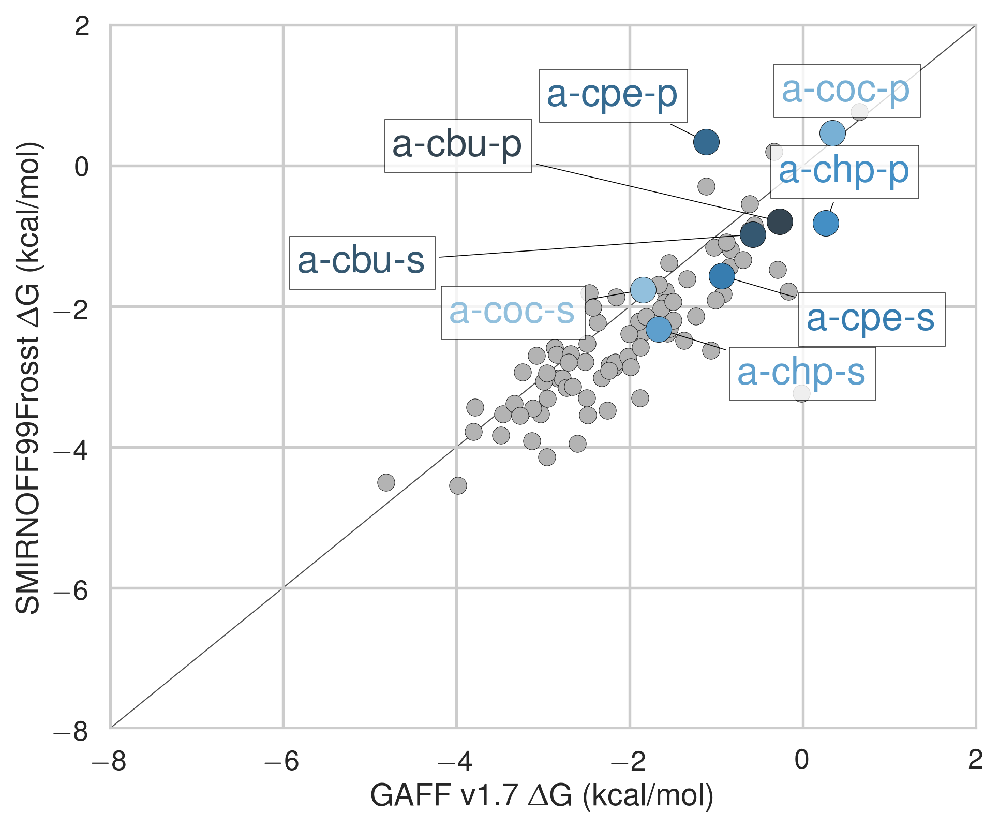{width=3.5in}
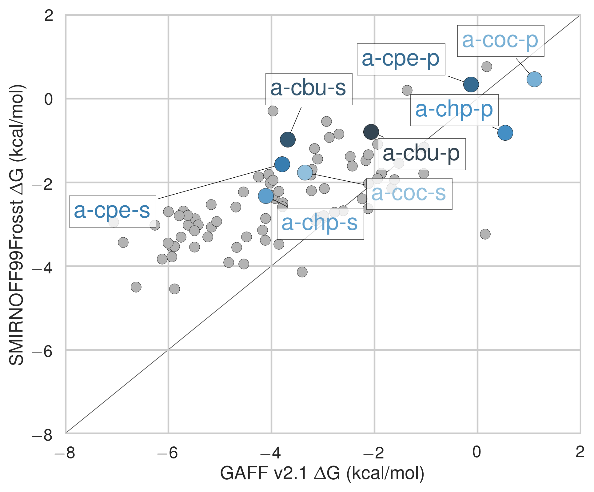{width=3.5in}

{width=3.5in}
{width=3.5in}

Binding free energy (ΔG) comparisons showing alcohols guests in color and highlighted.

{width=3.5in}
{width=3.5in}

{width=3.5in}
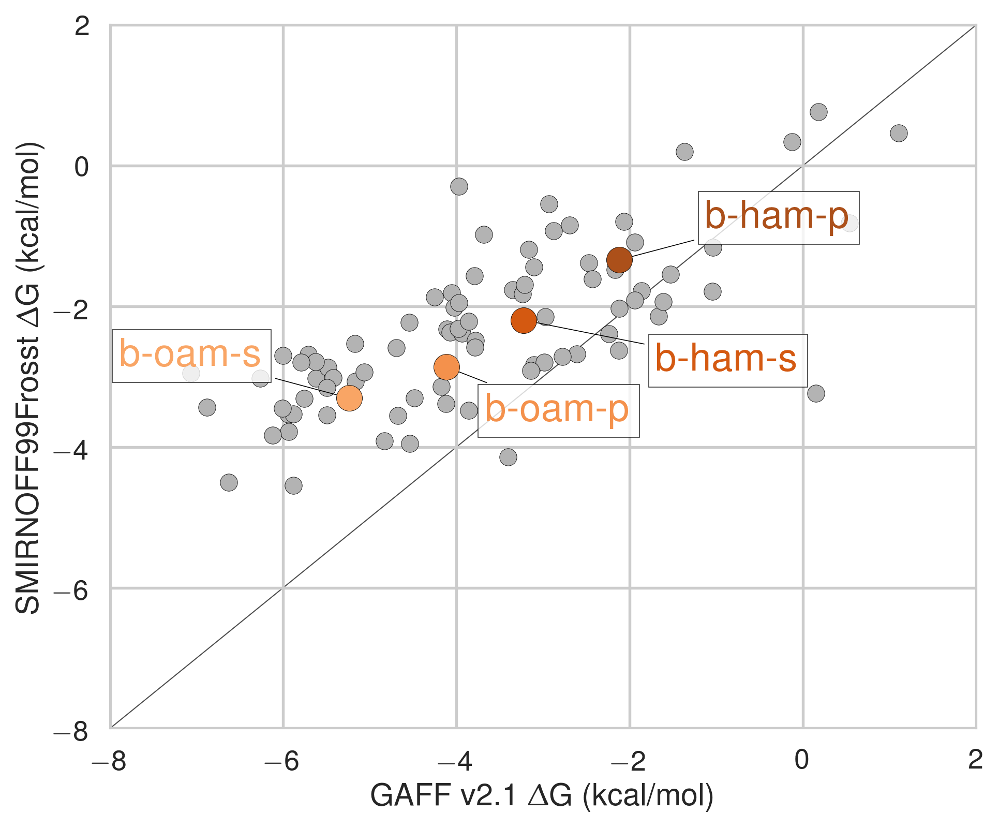{width=3.5in}

Binding free energy (ΔG) comparisons showing ammonium guests in color and highlighted.

{width=3.5in}
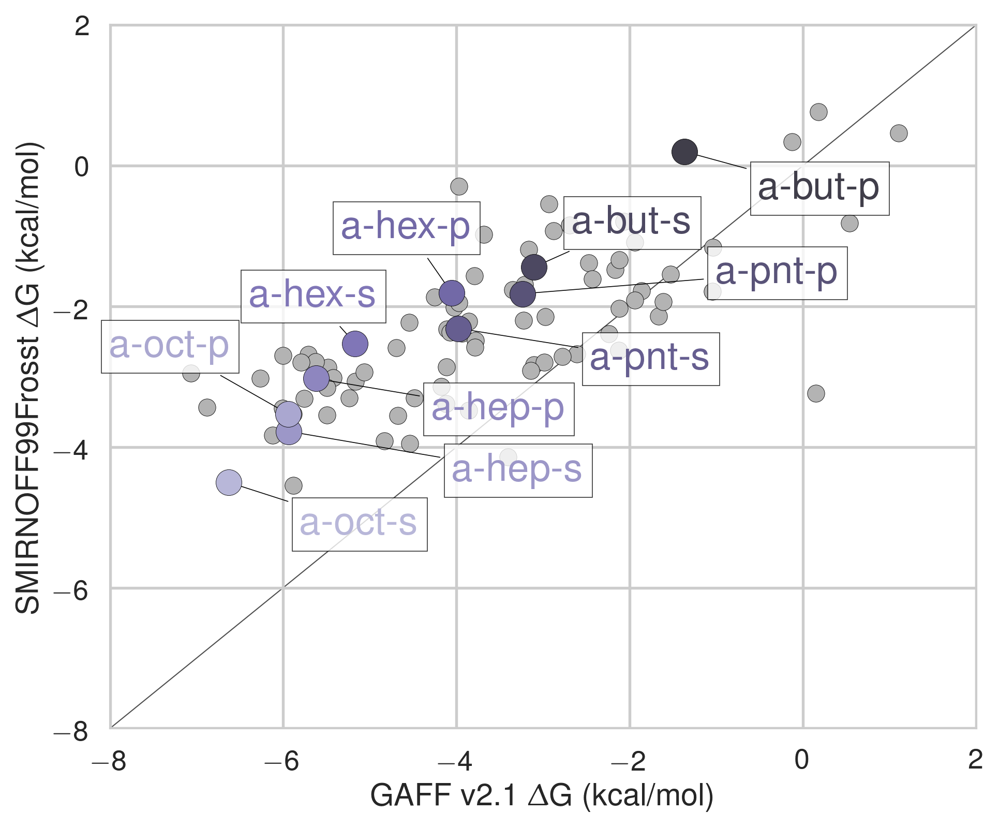{width=3.5in}

{width=3.5in}
{width=3.5in}

Binding free energy (ΔG) comparisons showing carboxylates guests in color and highlighted.

## References {.page_break_before}

<!-- Explicitly insert bibliography here -->

